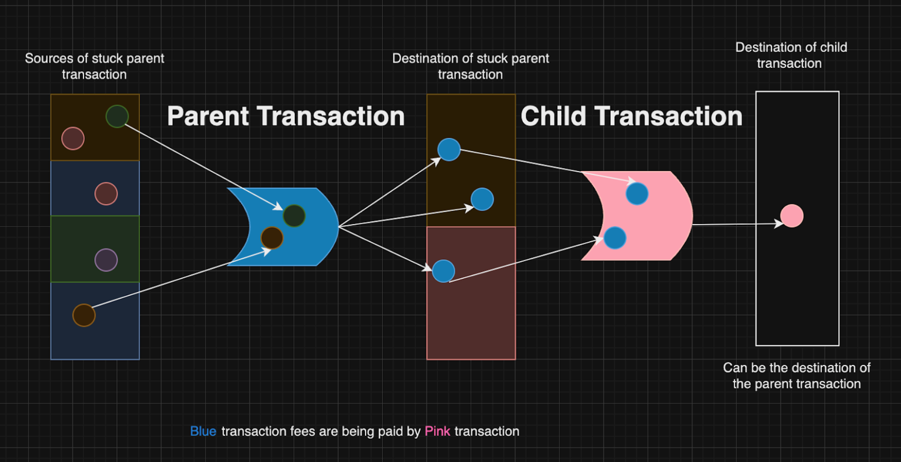

# Boost Transactions

Based on the Fireblocks “Boost Transactions” guidance ([reference](https://developers.fireblocks.com/reference/boost-transactions)).

## Overview
Child Pays For Parent (CPFP) lets you speed up a stuck UTXO transaction by sending a child transaction with a higher fee that spends one of the parent’s outputs.

**Prerequisites**
- Parent tx not older than 10 days and visible in mempool.
- Parent is marked **Completed** in Fireblocks (unless you spend its change output).
- You know at least one output (txHash + index) from the parent to spend in the child.

**When to use CPFP vs RBF**
- CPFP: pay a new high fee on a child that spends the parent’s output.
- RBF (EVM): replace pending tx with higher fee instead.

## Steps to boost (CPFP)
1. Confirm parent tx age < 10 days; switch to **Completed** if needed.
2. Pick at least one parent output (txHash/index) to use as child input.
3. Set a high custom fee (sat/byte) for the child.
4. Build the child transaction:
   - `source`: the destination of the stuck parent (or any destination you choose).
   - `destination`: can be the same vault or another destination.
   - `amount`: sum (or less) of the selected parent outputs.
   - `fee`: custom high value (don’t use `feeLevel`).
   - `extraParameters.inputsSelection.inputsToSpend`: include the chosen parent outputs.
5. Submit the child transaction.

## CPFP (Child Pays For Parent for BTC)
- Call **Get UTXO unspent inputs information** to find the stuck parent’s unspent outputs. Copy the `txHash` for any `Pending` inputs you want to spend.
- Create the CPFP transaction using the destination vault of the stuck parent as the `source` (`source.type`/`source.id`) and set `assetId`/`amount`.
- Use `fee` (custom, high) instead of `feeLevel`; if needed, call **Estimate transaction fee** to size the fee to cover both child and parent.
- In `extraParameters.inputsSelection.inputsToSpend`, include at least one parent output (`txHash`, `index`) to spend.
- Submit for approval and signing.

### Important notes
- Parent must be newer than 10 days; otherwise contact Support.
- Parent should be marked **Completed** (unless you spend its change UTXO).
- If the stuck tx is older than 10 days or not **Completed**, contact Fireblocks Support.

### How to switch the transaction to “Completed” status
- In Console: mark the transaction **Completed**, or
- API: set confirmation threshold to zero. If not switched, once the parent leaves the mempool the CPFP will fail.

### Constructing the CPFP transaction
- `Source`: the destination of the stuck transaction.
- `Destination`: same vault or any destination you prefer.
- `Amount`: up to the sum of selected parent outputs.
- `FeeLevel`: do **not** use; set a high custom `fee`.
- `CustomFee`: high enough to be attractive; use a CPFP calculator if needed.
- `ExtraParams`: specify `inputsSelection.inputsToSpend` with the parent outputs (at least one).

## Important notes
1. Parent older than 10 days → contact Support.
2. If parent not **Completed**, set confirmation threshold to zero or spend change output.
3. If parent not in mempool and source is yours, consider Transaction Replacement (RBF).

## Example

=== "TypeScript (ts-sdk)"

    ```ts
    let txPayload = {
      assetId: "BTC_TEST",
      amount: "0.001",
      fee: "1000", // sat/byte
      source: { type: TransferPeerPathType.VaultAccount, id: "0" },
      destination: { type: TransferPeerPathType.VaultAccount, id: "1" },
      extraParameters: {
        inputsSelection: {
          inputsToSpend: [
            { txHash: "24f769af0c2b67965ae4b95583c049e0a8ba08f1c142676c9fc9fcaac5ad12a3", index: 0 },
          ],
        },
      },
      note: "Your CPFP transaction!",
    };

    const createTransaction = async (payload: TransactionRequest) => {
      try {
        const result = await fireblocks.transactions.createTransaction({
          transactionRequest: payload,
        });
        console.log(JSON.stringify(result.data, null, 2));
        return result.data;
      } catch (error) {
        console.error(error);
      }
    };
    createTransaction(txPayload);
    ```

=== "cURL"

    ```bash
    curl -X POST https://api.fireblocks.io/v1/transactions \
      -H "X-API-Key: <API_KEY>" \
      -H "Authorization: Bearer <JWT>" \
      -H "Content-Type: application/json" \
      -d '{
        "assetId": "BTC_TEST",
        "amount": "0.001",
        "fee": "1000",
        "source": { "type": "VAULT_ACCOUNT", "id": "0" },
        "destination": { "type": "VAULT_ACCOUNT", "id": "1" },
        "extraParameters": {
          "inputsSelection": {
            "inputsToSpend": [
              { "txHash": "24f769af0c2b67965ae4b95583c049e0a8ba08f1c142676c9fc9fcaac5ad12a3", "index": 0 }
            ]
          }
        },
        "note": "Your CPFP transaction!"
      }'
    ```

=== "JavaScript (fireblocks-sdk-js)"

    ```js
    const { FireblocksSDK } = require("fireblocks-sdk");
    const fs = require("fs");
    const fb = new FireblocksSDK(fs.readFileSync("<PATH_TO_SECRET>", "utf8"), "<API_KEY>");

    (async () => {
      const tx = await fb.createTransaction({
        assetId: "BTC_TEST",
        amount: "0.001",
        fee: "1000",
        source: { type: "VAULT_ACCOUNT", id: "0" },
        destination: { type: "VAULT_ACCOUNT", id: "1" },
        extraParameters: {
          inputsSelection: {
            inputsToSpend: [
              {
                txHash: "24f769af0c2b67965ae4b95583c049e0a8ba08f1c142676c9fc9fcaac5ad12a3",
                index: 0,
              },
            ],
          },
        },
        note: "Your CPFP transaction!",
      });
      console.log(tx);
    })();
    ```

=== "Python (fireblocks-sdk-py)"

    ```python
    from fireblocks_sdk import FireblocksSDK
    from pathlib import Path

    fb = FireblocksSDK(Path("<PATH_TO_SECRET>").read_text(), "<API_KEY>")
    tx = fb.create_transaction(
        asset_id="BTC_TEST",
        amount="0.001",
        fee="1000",
        source={"type": "VAULT_ACCOUNT", "id": "0"},
        destination={"type": "VAULT_ACCOUNT", "id": "1"},
        extra_parameters={
            "inputsSelection": {
                "inputsToSpend": [
                    {
                        "txHash": "24f769af0c2b67965ae4b95583c049e0a8ba08f1c142676c9fc9fcaac5ad12a3",
                        "index": 0,
                    }
                ]
            }
        },
        note="Your CPFP transaction!",
    )
    print(tx)
    ```

## Summary checklist
- Parent tx < 10 days and in mempool.
- Mark parent **Completed** (unless using change output).
- Use custom high `fee`; avoid `feeLevel`.
- Specify parent outputs in `extraParameters.inputsSelection.inputsToSpend`.

## Notes
- If the parent has a change output, you can spend it to boost even if the destination isn’t under your custody.
- If you use the change output, switching the parent to **Completed** is not required.
- If the parent is no longer in the Fireblocks mempool and the source is within your workspace, consider Transaction Replacement (RBF) instead.

## Diagram


